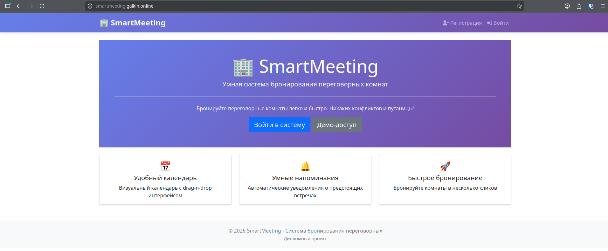

## Идея для дипломного проекта - Web система бронирования переговорных комнат в офисе

### Суть приложения: Календарь занятости ресурсов с запретом двойного бронирования.

* Бизнес-логика: Проверка пересечения временных интервалов (алгоритмическая задача).
* Асинхронность: Celery + Redis для отправки напоминаний за 1 час до встречи.
* Интеграции: Экспорт события в .ics файл (для импорта в Outlook/Google Календарь).

### Фреймворк для написания  приложения - Django

## Инструкция по первичному развертыванию приложения
1. Достаем ключ json для GitHub push registry 
```
terraform output -raw yc_sa_json_credentials_raw > key.json
xclip -selection clipboard < key.json
```
2. После поднятия k8s кластера подгатавливаем чувствительные данные. В GiHub создаем секреты.
  - YC_SA_JSON_CREDENTIALS - json ключ сервисного аккаунта для push registry из буфера после предыдущей команды
  - CR_REGISTRY_ID - id Реестра контейнеров
  - CR_REPOSITORY - smartmeeting
  - YC_CLOUD_ID - id Облака
  - YC_FOLDER_ID - id Папки
  - YC_K8S_CLUSTER_NAME - имя кластера
  
3. собираем образ приложения и загружаем его в Реестр контейнеров
```
docker build -t cr.yandex/<CR_REGISTRY_ID>/smartmeeting:latest .
docker push cr.yandex/<CR_REGISTRY_ID>/smartmeeting:latest
```
4. Устанавливаем дополнительные приложения в кластер
```
kubectl apply -f https://github.com/cert-manager/cert-manager/releases/download/v1.13.2/cert-manager.yaml
kubectl apply -f https://raw.githubusercontent.com/kubernetes/ingress-nginx/controller-v1.8.1/deploy/static/provider/cloud/deploy.yaml
```
проверяем статус приложений в кластере
```
kubectl get pods -n cert-manager
kubectl get pods -n ingress-nginx
```
5. Установаем наше приложение в кластер
```
kubectl apply -f k8s/deployment.yaml
```
6. Проверяем статус приложения в кластере
```
kubectl get pods -n smartmeeting
```
7. Доставем IP адрес ingress-nginx LoadBalancer
```
kubectl get svc ingress-nginx -n ingress-nginx
```
8. Добавляем DNS запись типа A smartmeeting.example.com с IP адресом ingress-nginx LoadBalancer

9. Через некоторое время заходимся на http://smartmeeting.example.com и проверяем работоспособность приложения



10. Окончательная настройка приложения
```
kubectl get pods -n smartmeeting
kubectl -n smartmeeting exec -it <web pod name> -- python manage.py create_rooms
kubectl -n smartmeeting exec -it <web pod name> -- python manage.py createsuperuser --username admin --email admin@example.com
kubectl -n smartmeeting exec -it <web pod name> -- python manage.py setup_reminder_schedule
```
