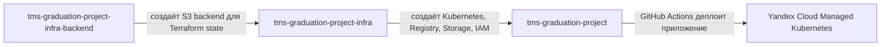
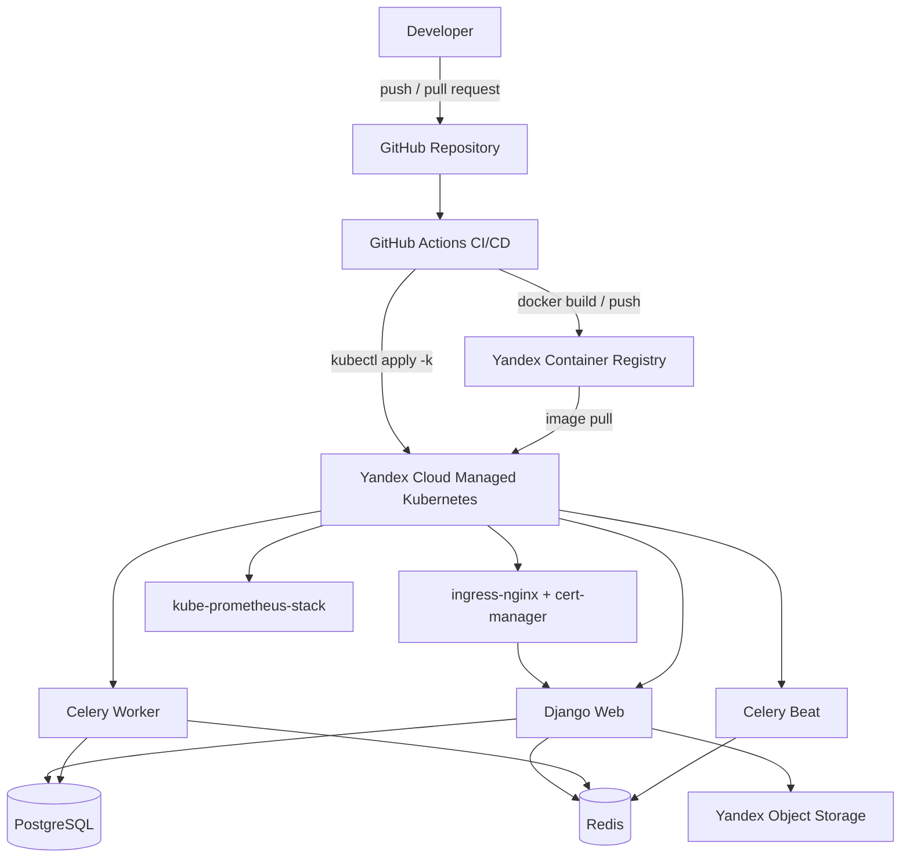
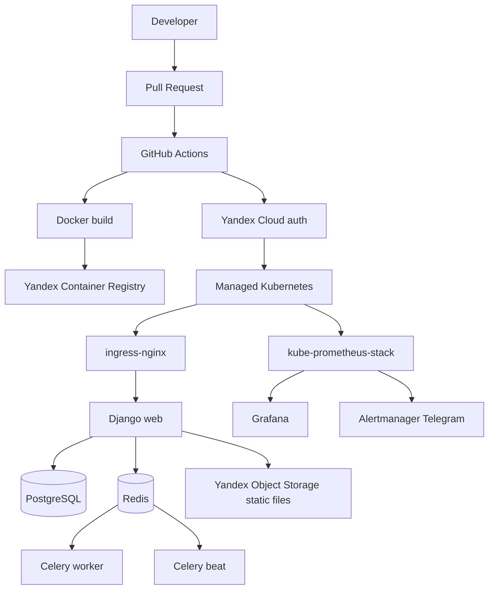

# SmartMeeting

<p align="center">
  <b>SmartMeeting</b> — web-система бронирования переговорных комнат с промышленным CI/CD, Kubernetes-деплоем и инфраструктурой в Yandex Cloud.
</p>

<p align="center">
  
  
  
  
  
  
</p>

---

## Содержание

- [Назначение проекта](#назначение-проекта)
- [Репозитории проекта](#репозитории-проекта)
- [Repository Structure](#repository-structure)
- [Стек](#стек)
- [Архитектура](#архитектура)
- [Git flow и правила веток](#git-flow-и-правила-веток)
- [Локальный запуск приложения](#локальный-запуск-приложения)
- [Подготовка Terraform backend](#подготовка-terraform-backend)
- [Создание основной инфраструктуры](#создание-основной-инфраструктуры)
- [GitHub Secrets](#github-secrets)
- [Первичное развертывание стенда](#первичное-развертывание-стенда)
- [CI/CD](#cicd)
- [Работа с feature-окружениями](#работа-с-feature-окружениями)
- [Мониторинг](#мониторинг)
- [Проверка после деплоя](#проверка-после-деплоя)
- [Типовые проблемы](#типовые-проблемы)

---

## Назначение проекта

SmartMeeting предназначен для бронирования переговорных комнат в офисе.

Система реализует календарь занятости переговорных комнат, запрет двойного бронирования, асинхронные задачи через Celery и Redis, периодические задачи через Celery Beat, PostgreSQL как основное хранилище, экспорт событий в `.ics`, staging/production/feature окружения в Kubernetes и автоматический деплой через GitHub Actions.

---

## Репозитории проекта

| Репозиторий | Назначение |
|---|---|
| `tms-graduation-project` | Django-приложение, Dockerfile, docker-compose, Kubernetes-манифесты, GitHub Actions CI/CD |
| `tms-graduation-project-infra-backend` | Bootstrap Terraform backend: S3-compatible bucket в Yandex Object Storage для хранения Terraform state |
| `tms-graduation-project-infra` | Основная инфраструктура Yandex Cloud: Managed Kubernetes, node group, VPC, Container Registry, Object Storage, service accounts, IAM-роли |

### Repository Dependency Diagram



Порядок работы:

```text
1. tms-graduation-project-infra-backend
   └─ создаёт backend для Terraform state

2. tms-graduation-project-infra
   └─ создаёт основную облачную инфраструктуру

3. tms-graduation-project
   └─ собирает и деплоит приложение в Kubernetes
```

---

## Repository Structure

Проект разделён на три самостоятельных репозитория: приложение, bootstrap backend для Terraform state и основная инфраструктура.

### `tms-graduation-project`

```text
tms-graduation-project/
├── .github/
│   └── workflows/
│       └── deploy.yaml              # CI/CD: build, push image, deploy to Kubernetes
├── k8s/
│   ├── base/                        # Общие Kubernetes manifests
│   │   ├── configmap.yaml           # Общие переменные окружения приложения
│   │   ├── celery-beat.yaml         # Deployment Celery Beat
│   │   ├── celery-worker.yaml       # Deployment Celery Worker
│   │   ├── ingress.yaml             # Базовый Ingress
│   │   ├── kustomization.yaml       # Базовая Kustomize-конфигурация
│   │   ├── namespace.yaml           # Базовый namespace manifest
│   │   ├── postgres.yaml            # PostgreSQL manifests
│   │   ├── redis.yaml               # Redis manifests
│   │   └── web.yaml                 # Django web Deployment/Service
│   ├── cluster/                     # Cluster-level ресурсы
│   │   ├── cluster-issuers.yaml     # cert-manager ClusterIssuer
│   │   └── kustomization.yaml
│   └── overlays/
│       ├── production/              # Production overlay: smartmeeting-prod
│       ├── staging/                 # Staging overlay: smartmeeting-staging
│       └── feature/                 # Feature overlay для временных окружений
├── smartmeeting/                    # Django project settings / Celery / URLs / WSGI-ASGI
├── meetings/                        # Django app бизнес-логики бронирования
├── templates/                       # HTML templates
├── static/                          # Static assets приложения
├── Dockerfile                       # Docker image приложения
├── docker-compose.yml               # Локальная разработка: web, postgres, redis, celery, beat
├── manage.py                        # Django management entrypoint
├── requirements.txt                 # Python dependencies
└── README.md                        # Общая документация проекта
```

### `tms-graduation-project-infra-backend`

```text
tms-graduation-project-infra-backend/
├── main.tf                          # Object Storage bucket, service account, IAM, static keys
├── provider.tf                      # Yandex Cloud provider
├── variables.tf                     # Входные переменные Terraform
├── outputs.tf                       # access_key / secret_key для remote backend
├── terraform.tfvars                 # Локальные значения переменных, не коммитить
└── README.md                        # Документация bootstrap backend
```

Назначение репозитория — один раз создать S3-compatible backend в Yandex Object Storage для хранения Terraform state основного инфраструктурного репозитория.

### `tms-graduation-project-infra`

```text
tms-graduation-project-infra/
├── backend.tf                       # Remote S3-compatible backend для Terraform state
├── provider.tf                      # Yandex Cloud provider
├── variables.tf                     # Входные переменные инфраструктуры
├── outputs.tf                       # Outputs для GitHub Actions и приложения
├── network.tf                       # VPC network / subnet
├── iam.tf                           # Service accounts и IAM-роли
├── registry.tf                      # Yandex Container Registry
├── storage.tf                       # Object Storage bucket для static files
├── k8s.tf                           # Managed Kubernetes cluster
├── node-group.tf                    # Kubernetes node group
├── terraform.tfvars                 # Локальные значения переменных, не коммитить
└── README.md                        # Документация основной инфраструктуры
```

> Имена отдельных Terraform-файлов могут отличаться от примера, но логическое разделение должно сохраняться: provider/backend, IAM, network, registry, storage, Kubernetes cluster, node group, variables и outputs.

---

## Стек

### Application

| Компонент | Использование |
|---|---|
| Python | Runtime приложения |
| Django 4.2 | Web framework |
| PostgreSQL 15 | Основная БД |
| Redis 7 | Broker/cache для Celery |
| Celery | Асинхронные задачи |
| Celery Beat | Периодические задачи |
| Gunicorn | WSGI-сервер |
| Docker / Docker Compose | Локальная разработка и упаковка приложения |

### Infrastructure / Platform

| Компонент | Использование |
|---|---|
| Terraform | Создание облачной инфраструктуры |
| Yandex Cloud Managed Kubernetes | Kubernetes-кластер приложения |
| Yandex Container Registry | Хранение Docker-образов |
| Yandex Object Storage | Terraform state и static files приложения |
| VPC / Subnet | Сетевая инфраструктура |
| Kubernetes / Kustomize | Деплой приложения и overlays окружений |
| ingress-nginx | Входящий HTTP/HTTPS traffic |
| cert-manager | Выпуск TLS-сертификатов |
| kube-prometheus-stack | Monitoring stack |
| GitHub Actions | CI/CD pipeline |

---

## Архитектура

### Infrastructure Diagram



### Runtime Components



| Branch | Environment | Namespace | Kustomize overlay | Domain |
|---|---|---|---|---|
| `main` | production | `smartmeeting-prod` | `k8s/overlays/production` | `PROD_APP_DOMAIN` |
| `staging` | staging | `smartmeeting-staging` | `k8s/overlays/staging` | `STAGING_APP_DOMAIN` |
| `feature/**` | feature | `feature-<branch>` | `k8s/overlays/feature` через временный overlay | staging domain / port-forward |

---

## Git flow и правила веток

| Ветка | Назначение | Правило обновления |
|---|---|---|
| `main` | Production | Только через Pull Request |
| `staging` | Pre-production / staging | Только через Pull Request. Исключение: первичное развертывание staging |
| `feature/**` | Разработка и проверка отдельных задач | Push разрешён, создаётся временное feature-окружение |

Ветки `main` и `staging` не должны обновляться прямым push. Исключение допускается только для `staging` при самом первом развертывании стенда.

Рекомендуемый процесс:

```text
feature/<task>
  └─ Pull Request → staging
       └─ Pull Request → main
```

---

## Локальный запуск приложения

### Требования

- Docker;
- Docker Compose;
- Git.

### Запуск

```bash
git clone https://github.com/Swaggasome/tms-graduation-project.git
cd tms-graduation-project
docker compose up --build
```

Docker Compose поднимает:

| Service | Назначение | Port |
|---|---|---|
| `web` | Django-приложение | `8000` |
| `postgres` | PostgreSQL 15 | `5432` |
| `redis` | Redis 7 | `6379` |
| `celery` | Celery worker | — |
| `celery-beat` | Celery Beat scheduler | — |

Выполнить первичную настройку:

```bash
docker compose exec web python manage.py migrate
docker compose exec web python manage.py create_rooms
docker compose exec web python manage.py setup_reminder_schedule
docker compose exec web python manage.py createsuperuser
```

Открыть приложение:

```text
http://localhost:8000
```

---

## Подготовка Terraform backend

Bootstrap выполняется из репозитория `tms-graduation-project-infra-backend`.

```bash
git clone https://github.com/Swaggasome/tms-graduation-project-infra-backend.git
cd tms-graduation-project-infra-backend
```

Создать `terraform.tfvars`:

```hcl
cloud_id        = "<CLOUD ID>"
folder_id       = "<FOLDER ID>"
bucket_name     = "<BUCKET NAME>"
token           = "<YANDEX CLOUD TOKEN>"
service_account = "<SERVICE ACCOUNT NAME>"
```

Применить Terraform:

```bash
terraform init
terraform apply
```

Будет создано:

- S3-compatible bucket для Terraform state;
- service account для доступа к Object Storage;
- IAM-права `storage.editor`;
- static access key / secret key.

Получить ключи backend:

```bash
ACCESS_KEY=$(terraform output -raw access_key)
SECRET_KEY=$(terraform output -raw secret_key)
```

---

## Создание основной инфраструктуры

Основная инфраструктура создаётся из репозитория `tms-graduation-project-infra`.

```bash
git clone https://github.com/Swaggasome/tms-graduation-project-infra.git
cd tms-graduation-project-infra
```

Инициализировать Terraform с remote backend:

```bash
terraform init \
  -backend-config="access_key=$ACCESS_KEY" \
  -backend-config="secret_key=$SECRET_KEY" \
  -reconfigure
```

Очистить переменные:

```bash
unset ACCESS_KEY SECRET_KEY
```

Создать `terraform.tfvars`:

```hcl
cloud_id        = "<CLOUD ID>"
folder_id       = "<FOLDER ID>"
bucket_name     = "<STATIC FILES BUCKET NAME>"
token           = "<YANDEX CLOUD TOKEN>"
service_account = "<SERVICE ACCOUNT NAME>"
ssh_public_key  = "<YOUR PUBLIC SSH KEY>"
```

Применить Terraform:

```bash
terraform plan
terraform apply
```

Будет создано:

- Managed Kubernetes cluster;
- Kubernetes node group;
- VPC network и subnet;
- Yandex Container Registry;
- Object Storage bucket для static files;
- service accounts для Kubernetes, node group, GitHub Actions и registry;
- static access keys для static files bucket;
- IAM-роли для service accounts.

Критичные outputs:

| Output | GitHub Secret |
|---|---|
| `yc_sa_json_credentials_raw` | `YC_SA_JSON_CREDENTIALS` |
| `registry_id` | `CR_REGISTRY_ID` |
| `static_files_access_key` | `YC_STORAGE_ACCESS_KEY` |
| `static_files_secret_key` | `YC_STORAGE_SECRET_KEY` |
| `k8s_id` | `YC_K8S_CLUSTER_ID` |

Пример копирования в буфер JSON-ключа:

```bash
terraform output -raw yc_sa_json_credentials_raw > key.json &&  \
xclip -selection clipboard < key.json && \
rm key.json
```
Тоже самое надо сделать по остальным outputs при этом заполняя секреты в GitHub
---

## GitHub Secrets

Secrets задаются в `tms-graduation-project`:

```text
Settings → Secrets and variables → Actions → New repository secret
```

### Yandex Cloud / Container Registry / Kubernetes

| Secret | Назначение |
|---|---|
| `YC_SA_JSON_CREDENTIALS` | JSON-ключ service account для GitHub Actions |
| `YC_CLOUD_ID` | ID Yandex Cloud |
| `YC_FOLDER_ID` | ID folder |
| `YC_K8S_CLUSTER_ID` | ID Managed Kubernetes cluster |
| `CR_REGISTRY_ID` | ID Yandex Container Registry |
| `CR_REPOSITORY` | Имя Docker repository, например `smartmeeting` |

### Domains / TLS

| Secret | Назначение |
|---|---|
| `CERT_MANAGER_EMAIL` | Email для Let's Encrypt ClusterIssuer |
| `PROD_APP_DOMAIN` | Production domain |
| `STAGING_APP_DOMAIN` | Staging domain |

### Object Storage / SMTP

| Secret | Назначение |
|---|---|
| `YC_STORAGE_BUCKET_NAME` | Bucket для static files |
| `YC_STORAGE_ACCESS_KEY` | Static access key |
| `YC_STORAGE_SECRET_KEY` | Static secret key |
| `EMAIL_HOST_USER` | Gmail-аккаунт для отправки уведомлений |
| `EMAIL_HOST_PASSWORD` | Gmail app password |
| `DEFAULT_FROM_EMAIL` | Email from |

### Production

| Secret | Назначение |
|---|---|
| `PROD_DB_USER` | Пользователь PostgreSQL |
| `PROD_DB_PASSWORD` | Пароль PostgreSQL |
| `PROD_DB_DATABASE` | Имя БД |
| `PROD_DJANGO_SECRET_KEY` | Django secret key |

### Staging / Feature

| Secret | Назначение |
|---|---|
| `STAGING_DB_USER` | Пользователь PostgreSQL |
| `STAGING_DB_PASSWORD` | Пароль PostgreSQL |
| `STAGING_DB_DATABASE` | Имя БД |
| `STAGING_DJANGO_SECRET_KEY` | Django secret key |

---

## Первичное развертывание стенда

Настроить доступ к Kubernetes:

```bash
yc managed-kubernetes cluster get-credentials \
  --id <YC_K8S_CLUSTER_ID> \
  --external \
  --force

kubectl get nodes
```

Установить `cert-manager` и `ingress-nginx` вручную:

```bash
kubectl apply -f https://github.com/cert-manager/cert-manager/releases/download/v1.19.5/cert-manager.yaml
kubectl apply -f https://raw.githubusercontent.com/kubernetes/ingress-nginx/controller-v1.8.1/deploy/static/provider/cloud/deploy.yaml
```

Установить cluster-level ресурсы приложения:

```bash
kubectl apply -k k8s/cluster/.
```


Получить внешний IP LoadBalancer:

```bash
kubectl get svc ingress-nginx-controller \
  -n ingress-nginx \
  -o jsonpath='{.status.loadBalancer.ingress[0].ip}'
```

Создать DNS A-записи:

```text
smartmeeting.<domain>          A    <INGRESS_EXTERNAL_IP>
staging.smartmeeting.<domain>  A    <INGRESS_EXTERNAL_IP>
```

Подготовить мониторинг:

```bash
kubectl create namespace monitoring
kubectl create secret generic telegram-alerts \
  -n monitoring \
  --from-literal=bot-token='<TELEGRAM_BOT_TOKEN>' \
  --from-literal=chat-id='<TELEGRAM_CHAT_ID>'
```
Зайти в Actions на GitHub и запустить Action - Install Monitoring вручную

Первичный deploy staging. Это единственный допустимый случай прямого push в `staging`:

```bash
git checkout staging
git add .
git commit -m "Init staging deployment"
git push origin HEAD
```

Создать superuser в staging:

```bash
kubectl get pods -n smartmeeting-staging
kubectl exec -it deployment/web -n smartmeeting-staging -- python manage.py createsuperuser
```

Продвижение в production выполняется через Pull Request `staging → main`.

После production deploy:

```bash
kubectl get pods -n smartmeeting-prod
kubectl exec -it deployment/web -n smartmeeting-prod -- python manage.py createsuperuser
```

---

## CI/CD

CI/CD workflow находится в `.github/workflows/deploy.yaml`.

Workflow запускается при push в:

```text
main
staging
feature/**
```

И также вручную через `workflow_dispatch`.


Workflow выполняет:

1. Определение окружения по ветке.
2. Сборку Docker-образа.
3. Push в Yandex Container Registry:

   ```text
   cr.yandex/<CR_REGISTRY_ID>/<CR_REPOSITORY>:<GITHUB_SHA>
   ```

4. Аутентификацию в Yandex Cloud.
5. Получение kubeconfig.
6. Установку `cert-manager` и `ingress-nginx`.
7. Применение `k8s/cluster`.
8. Создание namespace.
9. Генерацию временного `k8s/base/.env.secret` из GitHub Secrets.
10. Подготовку Kustomize overlay.
11. Проверку манифестов через `kubectl apply --dry-run=client`.
12. Деплой через `kubectl apply -k`.
13. Ожидание rollout `web`, `celery-worker`, `celery-beat`.
14. Удаление временных файлов.

Для `main` и `staging` рекомендуется включить GitHub Rulesets / Branch protection:

- запрет direct push;
- обязательный Pull Request;
- обязательный status check `validate`;
- запрет force push;
- запрет удаления ветки.

---

## Работа с feature-окружениями

Push в ветку:

```text
feature/<task-name>
```

создаёт namespace:

```text
feature-<task-name>
```

Проверка:

```bash
kubectl get pods -n feature-<task-name>
kubectl port-forward -n feature-<task-name> svc/web 8000:8000
```

Открыть:

```text
http://localhost:8000
```

Удаление ветки:

```bash
git branch -D feature/<task-name>
git push origin --delete feature/<task-name>
```

Удаление namespace при необходимости:

```bash
kubectl delete namespace feature-<task-name>
```

---

## Мониторинг

Monitoring namespace:

```text
monitoring
```

Компоненты:

- Prometheus;
- Grafana;
- Alertmanager;
- Telegram receiver;
- dashboards для Kubernetes / Django.

Alertmanager:

```bash
kubectl port-forward -n monitoring \
  svc/monitoring-kube-prometheus-alertmanager \
  9093:9093
```

Grafana:

```bash
kubectl port-forward -n monitoring svc/monitoring-grafana 3000:80
```

Рекомендуемые dashboards:

```text
15757
20693
```

Prometheus:

```bash
kubectl port-forward -n monitoring \
  svc/monitoring-kube-prometheus-prometheus \
  9090:9090
```

---

## Проверка после деплоя

```bash
kubectl get pods -n smartmeeting-staging
kubectl get pods -n smartmeeting-prod

kubectl rollout status deployment/web -n smartmeeting-staging
kubectl rollout status deployment/celery-worker -n smartmeeting-staging
kubectl rollout status deployment/celery-beat -n smartmeeting-staging

kubectl get ingress -A
kubectl get certificate -A
kubectl get challenge -A
kubectl get order -A

kubectl logs -n smartmeeting-staging deployment/web
kubectl logs -n smartmeeting-staging deployment/celery-worker
kubectl logs -n smartmeeting-staging deployment/celery-beat
```

---

## Типовые проблемы

### `cluster with id or name "..." not found`

Проверить `YC_K8S_CLUSTER_ID`, `YC_FOLDER_ID`, права service account и расположение кластера в нужном folder.

### `ImagePullBackOff`

Проверить `CR_REGISTRY_ID`, `CR_REPOSITORY`, наличие образа в registry и права node service account.

### `CrashLoopBackOff` у `web`

```bash
kubectl logs -n smartmeeting-staging deployment/web --previous
```

Частые причины:

- неверный `DJANGO_SECRET_KEY`;
- ошибка подключения к PostgreSQL;
- не выполнены миграции;
- неверные Object Storage credentials;
- неверный domain / CSRF trusted origins.

### Сертификат не выпускается

```bash
kubectl get certificate -A
kubectl get challenge -A
kubectl describe challenge -n <namespace> <challenge-name>
```

Проверить DNS A-запись, ClusterIssuer, `CERT_MANAGER_EMAIL` и ingress host.

### Alertmanager: `undefined receiver "null" used in route`

В route должен использоваться существующий receiver, например `telegram`, а не `null`.

```bash
kubectl get alertmanager -n monitoring -o yaml
kubectl get secret -n monitoring alertmanager-monitoring-kube-prometheus-alertmanager-generated -o yaml
```

---

## Безопасность

- Не коммитьте `terraform.tfvars`.
- Не коммитьте `.env.secret`.
- Не коммитьте Yandex Cloud JSON key.
- Не храните Telegram bot token и chat id в README или Kubernetes manifests.
- После копирования чувствительных outputs удаляйте временные файлы.
- Для `main` и `staging` используйте branch protection и Pull Request workflow.

---

## Краткий порядок полного запуска

```text
1. tms-graduation-project-infra-backend → terraform apply
2. Получить ACCESS_KEY / SECRET_KEY backend
3. tms-graduation-project-infra → terraform init -backend-config=...
4. tms-graduation-project-infra → terraform apply
5. Перенести Terraform outputs в GitHub Secrets приложения
6. Настроить Kubernetes доступ и DNS
7. Создать monitoring namespace и Telegram secret
8. Выполнить первичный deploy staging
9. Создать superuser в staging
10. Создать PR staging → main
11. После production deploy создать superuser в production
```
